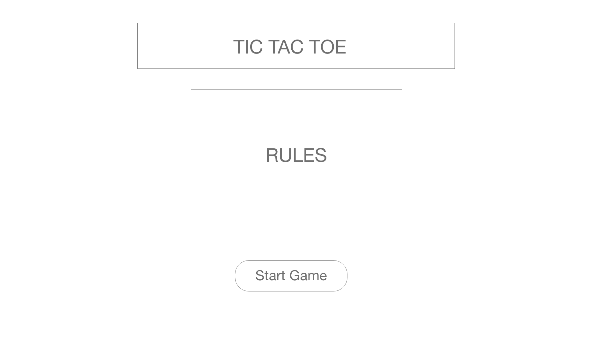
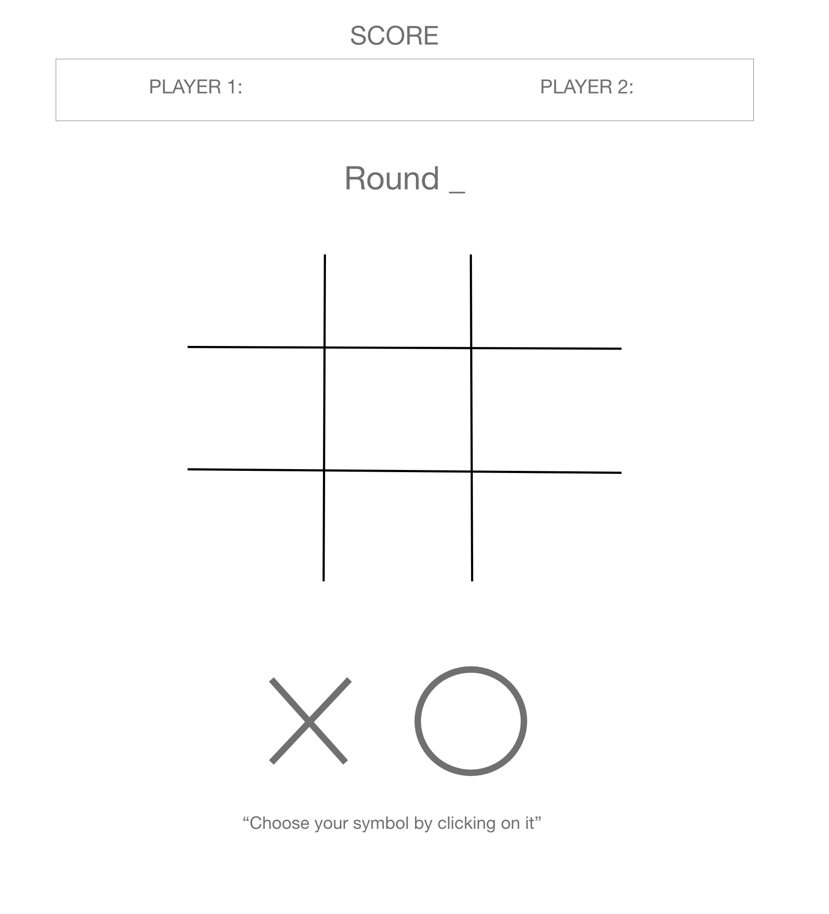

# Tic Tac Toe

### Rules of the game
(There will be 3 rounds)
1. player 1 choose your symbol
2. player 2 will go first 
3. take turns placing your symbols in the block 
4. if a player places their symbol 3 in a row, they win

### Technical Challenges
- having fully functional javascript

### Wireframe

### Additional features
- if no one gets three in a row they redo the round and each player can place two symbols on their turn (possibly will be able to do)

### Timeline

-[Tuesday]: work on setting up HTML (divs) for first and second page. also pseudocode for javascript.

-[Wednesday]: work on javascript 

-[Thursday]: work on javascript 

-[Friday]: work on javascript

-[Saturday]: work on javascript

-[Sunday]: add in CSS and make sure javascript is functioning properly 

-[Monday]: add additional creative touches